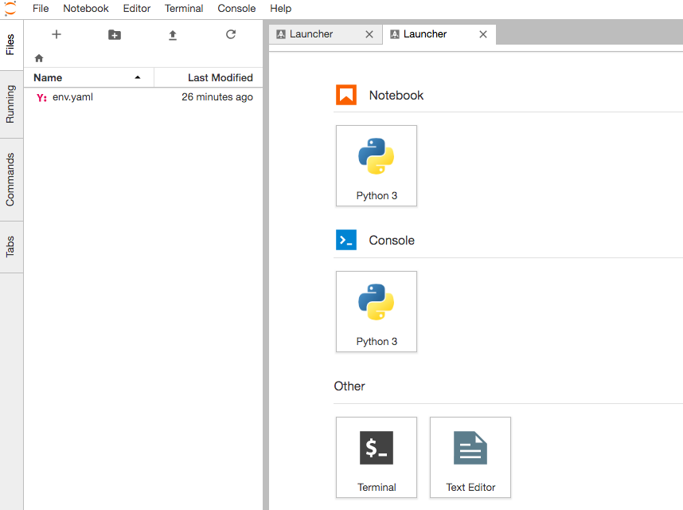

# 2.機械学習を行う環境の構築

Docker Compose で機械学習の環境を構築します。
今回は、Anaconda の Docker イメージを元に、Tensorflow、Keras をインストールします。

##### 補足

なお、Docker 環境を作るのが大変な場合は、OS に Anaconda をインストールして対応することも可能です。筆者は OS から分離した環境で機械学習を行いたかったため、Docker を使用しました。


## 前提条件

前提条件は、Docker Compose を使用できること。

未インストールの場合は、Docker Tools をインストールするなどして Docker Compose の利用環境を用意してください。

## Docker Compose

### ファイルを用意

Dockerfile と docker-compose.yml の二つのファイルを準備します。

##### Dockerfile

```Dockerfile
FROM continuumio/anaconda3
WORKDIR /workspace
RUN conda install -y tensorflow
RUN conda install -y keras
CMD jupyter-lab --no-browser \
  --port=8888 --ip=0.0.0.0 --allow-root
```

##### docker-compose.yml

```yaml
version: '3'
services:
    ml:
        build: .
        volumes:
            - ./workspace:/workspace
        networks:
            - default
        ports:
            - "8888:8888"
            - "6006:6006"
```

### イメージのビルド

次のコマンドを実行すると、機械学習用のイメージがビルドされます。このコマンドは docker-compose.yml の存在するディレクトリか、その配下のディレクトリで実行してください。

```shell
$ docker-compose build
```

これで環境構築は完了です。

### コンテナの起動

先ほどビルドしたイメーイからコンテナを起動するには次のコマンドを実行します。

```shell
$ docker-compose up -d
```

コンテナの稼動に関するその他のオペレーションは、次のように行います。


```shell
# コンテナの稼働状況を確認
$ docker-compose ps

# コンテナの停止
$ docker-compose stop
```


### Jupyter Lab のページへアクセスできることを確認

今後、Jupyter Lab で作業する機会があるため、ブラウザでアクセスできることを確認します。筆者の環境では Docker Toolbox を使用して仮想ノード上で Docker を起動しているため、次のアドレスになります。ローカルホスト上で Docker を起動している場合は、アドレスをlocalhost に差し替えてください。

http://192.168.99.100:8888/

ログインするために、token 文字列を入力する必要があります。次のコマンドを実行すると、token 文字列を確認できます。

```
$ docker-compose logs
```

token をブラウザ画面上で入力するとログインできます。


