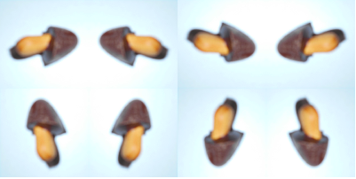

# 5.学習用の画像を増やす

機械学習には大量の画像が必要になります。前章で撮影した画像を元に回転、反転の操作を加えて画像を増やします。

### 画像を増やすスクリプトの実行

画像を増やすためのスクリプトを用意しました。  
[script/image_huyasu_kun.py](script/image_huyasu_kun.py)

このスクリプトを ```workspace/scripts``` に配置します。そして、次のコマンドを実行することで画像を増やすことができます。増やした画像はきのこ、たけのこ、それぞれ ```workspace/image/kakou/kinoko```、```workspace/image/kakou/takenoko``` に出力されます。


```shell
# きのこの山の画像を増やす
$ docker-compose run --rm ml python /workspace/scripts/image_huyasu_kun.py --category kinoko
# たけのこの里の画像を増やす
$ docker-compose run --rm ml python /workspace/scripts/image_huyasu_kun.py --category takenoko
```

以降は解説になります。

### 画像の増やし方

元画像を 8 倍の枚数に増やしています。元画像、 90 度回転させた画像を元に、「左右反転」「上下反転」「点対称」の操作を加えています。これで元画像を含めて 8 倍になります。画像の操作は PIL モジュールを用いています。



画像を増やすサンプルをノートブックで用意しました。  
[image_huyashi.ipynb](notebook/image_huyashi.ipynb)

### PIL モジュールの使い方解説

モジュールをインポートします。

```python
from PIL import Image
```

画像ファイルを開きます。

```python
im = Image.open('画像ファイルのパス')
```

横幅、高さは属性値で持っています。

```python
# 横幅
w = im.width
# 高さ
h = im.height
```

回転、反転は次のように行います。

```python
# 反時計回りに 90 度回転(縦横のサイズが同じ必要があります)
im.transpose(Image.ROTATE_90):
# 左右反転
im.transpose(Image.FLIP_LEFT_RIGHT)
# 上下反転
im.transpose(Image.FLIP_TOP_BOTTOM)
# 点対称
im.transpose(Image.ROTATE_180)
```
