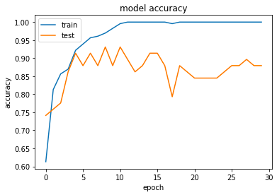
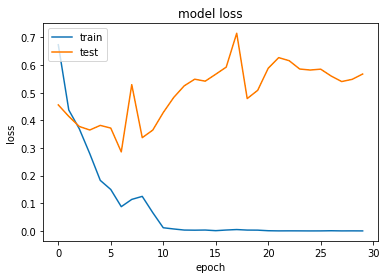
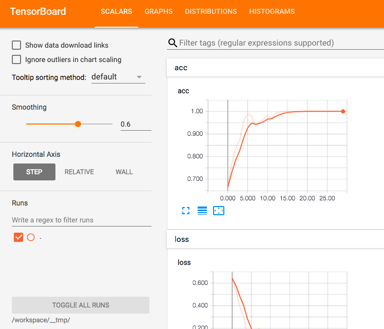

# 7.学習を行う

今まで用意した画像を用いて学習を行います。

### 学習を行うスクリプトの実行

学習を行うためのスクリプトを用意しました。  
[script/machine_learning.py](script/machine_learning.py)

このスクリプトを ```workspace/scripts``` に配置します。
このスクリプトは前章で説明した前処理と、この章で説明する学習を行うものです。次のコマンドで実行します。

```shell
$ docker-compose run --rm ml python /workspace/scripts/machine_learning.py --categories kinoko,takenoko --epochs 30
```

精度(= 正答率)を確認します。今回は筆者が用意した画像数が少なく、モデルも簡単なため、正答率は 87 % ほどしかでていません。

```
Test loss: 0.721688917999
Test accuracy: 0.879310348938
```

以降は解説になります。

### モデルの定義

モデルの定義を簡単に行うことができるのが Keras のいいところです。

サンプルスクリプト ```machine_learning.py``` では以下のモデル定義としています。ぱっと見でどのようにレイヤを重ねているかが理解しやすいかと思います。

```python
model = Sequential()
model.add(Dense(512, activation='relu', input_shape=(IMAGE_SIZE * IMAGE_SIZE,)))
model.add(Dropout(0.2))
model.add(Dense(512, activation='relu'))
model.add(Dropout(0.2))
model.add(Dense(512, activation='relu'))
model.add(Dropout(0.2))
model.add(Dense(len(categories), activation='softmax'))
```

ニューラルネットワークのモデルです。ニューラルネットワークは、入力層、中間層(隠れ層)、出力層の三つからなります。

##### 入力層

画像サイズを一次元化した numpy 配列です。

##### 中間層

ニューラルネットの層を重ねています。各層のニューロンの個数は 512 個にしています。

各層の活性化関数は ReLU としています。**ReLU** は入力が正の場合はそのまま出力し、負の場合は 0 を出力する関数です。

また、Dropout を有効にしています。Dropout はニューロンをランダムに消去しながら学習する手法です。過学習を抑制する効果があると言われます。

##### 出力層

入力を正規化する層です。分類問題では、出力層で **softmax関数** を使います。

### 訓練を行う方法

訓練を行う方法を指定するのが ```model.compile``` です。

```python
model.compile(loss='categorical_crossentropy',
    optimizer=Adam(),
    metrics=['accuracy'])
```

機械学習の学習は大量のデータを読み込んで行います。教師データとの差が小さくなるように、モデルを最適にしていきます。教師データとのずれの大きさを示すのが **損失関数**。これが小さくなるように学習を進めていきます。損失関数は loss で指定します。

損失関数を小さくするようにニューラルネットワークを訓練することは最適化問題を解くことだとも言えます。最適化手法は optimizer で指定します。

### 学習の実行

model.fit で学習の実行を行います。

```python
history = model.fit(x_train, y_train,
    batch_size=int(args.batch_size),
    epochs=int(args.epochs),
    verbose=1,
    callbacks=callbacks,
    validation_data=(x_test, y_test))

score = model.evaluate(x_test, y_test, verbose=0)
print('Test loss:', score[0])
print('Test accuracy:', score[1])
```

model.fit の引数を説明します。

x_train、y_train は学習用のデータ(x が画像、y がそのラベル)です。

学習を行う際、一つの入力データではなく複数のデータを一気に処理した方が計算時間を短縮できます。batch_zize **(バッチサイズ)** で、何個のデータを 1 回で処理するかを指定します。

例えば、学習用データが 1,000 個あったとして、バッチサイズが 50 の場合は、20 回繰り返すとすべての学習用データを見たことになります。このすべての学習データを見た状態が 1 **エポック** です。epochs(エポック数)によって、何エポック数分、学習を実行するかを指定します。

callbacks は学習中に実行できる関数群です。ここでは後述する TensorBoard で画面表示するためのログを出力しています。

```
callbacks = [keras.callbacks.TensorBoard(log_dir="/workspace/__tmp/", histogram_freq=1)]
```

validation_data は学習には使用せず、過学習が起きていないかどうかをチェックするための検査用のデータです。

model.hit を history に格納します。精度、loss の推移を確認するのに使用します。

最後に loss、精度を出力します。モデルが過学習を起こさず、汎用的に正答率高く作られたかどうかを評価する用途です。

### モデルの保存

model.save でモデルの保存を行います。このファイルは推論に用いるファイルです。別の環境に持ち出しても推論に利用することができます。

```python
model.save('/workspace/models/ml.model.h5')
```

### 学習進捗の保存

精度、loss の推移をファイルに保存します。pickle を使用します。これは、オブジェクトの中身をファイルに出力するモジュールです。

```python
with open('/workspace/__tmp/ml.history.pickle', 'wb') as f:
            pickle.dump(history.history, f)
```

### 精度、loss 推移のグラフ化

精度、loss 推移をグラフ化するノートブックを用意しました。  
[history.ipynb](notebook/history.ipynb)

精度は次の通り。学習用画像では順調に上がっていますが、テスト画像では伸び悩んでいます。



loss は次の通り。train がエポック数 10 でほぼ 0 になっています。test の loss が下がっていないので過学習気味です。



### TensorBoard で確認

TensorBoard は、モデルをグラフで可視化したり、学習の進行具合などをブラウザ上で確認できるツールです。次のコマンドで TensorBoard を起動します。

```
$ docker-compose exec ml tensorboard --logdir=/workspace/__tmp/
```

起動後にブラウザでアクセスします。筆者の環境では Docker Toolbox を使用して仮想ノード上で Docker を起動しているため、次のアドレスになります。ローカルホスト上で Docker を起動している場合は、アドレスをlocalhost に差し替えてください。

http://192.168.99.100:6006/


